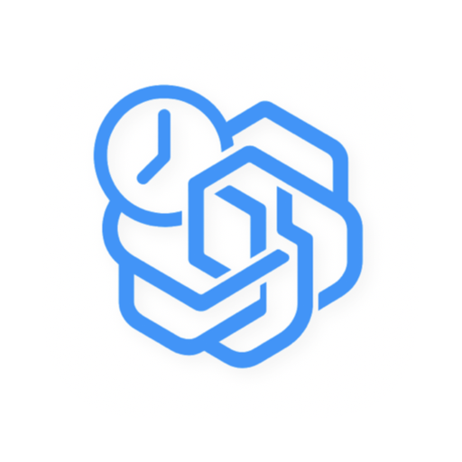

# Agent Sessions CN（macOS）

[](https://github.com/Gus-616/agent-sessions-cn/actions/workflows/ci.yml)

<table>
<tr>
<td width="100" align="center">
  
</td>
<td>

**Agent Sessions 中文汉化独立版。**  
这是一个本地优先的 macOS AI 编码会话浏览器，统一管理 Codex CLI、Claude Code、Cursor、Gemini CLI、GitHub Copilot CLI、OpenCode、OpenClaw 等会话记录。

当前版本基于原作者 [jazzyalex/agent-sessions](https://github.com/jazzyalex/agent-sessions) 二次开发与中文本地化，汉化与维护：**Gus616**。

</td>
</tr>
</table>

- 系统要求：macOS 14+
- 协议：MIT
- 隐私策略：本地优先、无遥测、不上传会话内容

<p align="center">
  <a href="https://github.com/Gus-616/agent-sessions-cn/releases/download/v3.6.2-zh.1/AgentSessions-ZH-3.6.2.dmg"><b>下载 Agent Sessions CN v3.6.2-zh.1（DMG）</b></a>
  •
  <a href="https://github.com/Gus-616/agent-sessions-cn/releases">所有版本</a>
  •
  <a href="#安装">安装</a>
  •
  <a href="#核心功能">核心功能</a>
  •
  <a href="#开发">开发</a>
</p>

## 项目说明

这个仓库用于维护 **Agent Sessions 的中文汉化独立版**，目标是：

- 提供完整中文界面
- 保持和原项目功能基本一致
- 移除应用自身在线更新，避免覆盖汉化版
- 保留本地优先、只读索引、统一会话检索这些核心能力

当前发布版本：`v3.6.2-zh.1`

## 当前版本状态

这一版已经包含：

- 全应用中文本地化
- 图片浏览器、设置页、主窗口、菜单、提示文案等中文化
- 移除应用自身 `Check for Updates` / Sparkle 更新链路
- 会话列表右键支持删除原始 `JSONL`，并同时删除本地保存副本
- About 页补充原项目来源与汉化维护信息

当前未包含：

- Homebrew 安装
- 应用内自动更新
- Developer ID 正式签名与 Apple 公证

## 核心功能

- 统一浏览多个 AI 编码代理的历史会话
- 跨会话全文搜索、项目筛选、模型筛选
- 会话转录查看、代码块浏览、图片浏览
- 支持复制恢复命令，快速回到历史会话
- Agent Cockpit / 用量跟踪 / 统一窗口等原项目能力
- 本地索引、无云端上传、会话内容不出机器

## 支持的会话来源

- Codex CLI
- Claude Code
- Cursor
- Gemini CLI
- GitHub Copilot CLI
- OpenCode
- OpenClaw
- Droid（遗留导入）

## 安装

### 方式一：下载 DMG

1. 下载 [AgentSessions-ZH-3.6.2.dmg](https://github.com/Gus-616/agent-sessions-cn/releases/download/v3.6.2-zh.1/AgentSessions-ZH-3.6.2.dmg)
2. 将 **Agent Sessions.app** 拖入“应用程序”

### 首次打开说明

当前公开发布的 `DMG` **未做 Developer ID 公证**。  
因此在部分 macOS 环境下，首次打开时可能看到安全提示。

如果系统拦截，可按下面方式放行：

1. 先尝试打开一次应用
2. 打开 `系统设置 -> 隐私与安全性`
3. 在安全提示区域点击 **仍要打开 / Open Anyway**

这不影响应用本身功能。

## 隐私与安全

- 本地优先，无遥测
- 默认不上传任何会话内容
- 主要读取本地会话目录与索引数据
- 当前版本额外支持在应用内删除原始 `JSONL` 会话文件，因此这是一个**带本地文件管理能力**的版本，不再是完全只读壳层

更多说明见：

- [docs/PRIVACY.md](docs/PRIVACY.md)
- [docs/security.md](docs/security.md)

## 与原项目的关系

本仓库不是原作者官方仓库，也不是原版自动更新分支。  
它是基于原项目源码制作的中文汉化独立版本。

原项目地址：

- GitHub：[jazzyalex/agent-sessions](https://github.com/jazzyalex/agent-sessions)
- 原作者：jazzyalex

## 文档

- 更新记录：`docs/CHANGELOG.md`
- 隐私：`docs/PRIVACY.md`
- 安全：`docs/security.md`
- 维护与发布备注：`docs/deployment.md`

## 开发

前置要求：

- Xcode（macOS 14+）

构建 Debug：

```bash
xcodebuild -project AgentSessions.xcodeproj -scheme AgentSessions -configuration Debug -destination 'platform=macOS' build
```

构建 Release：

```bash
xcodebuild -project AgentSessions.xcodeproj -scheme AgentSessions -configuration Release -destination 'platform=macOS' build
```

运行测试：

```bash
xcodebuild -project AgentSessions.xcodeproj -scheme AgentSessionsTests -destination 'platform=macOS' test
```

## 发布说明

当前 GitHub Release：

- [Agent Sessions CN v3.6.2-zh.1](https://github.com/Gus-616/agent-sessions-cn/releases/tag/v3.6.2-zh.1)

对应资产：

- `AgentSessions-ZH-3.6.2.dmg`
- `AgentSessions-ZH-3.6.2.dmg.sha256`

## License

MIT。详见 [LICENSE](LICENSE)。
